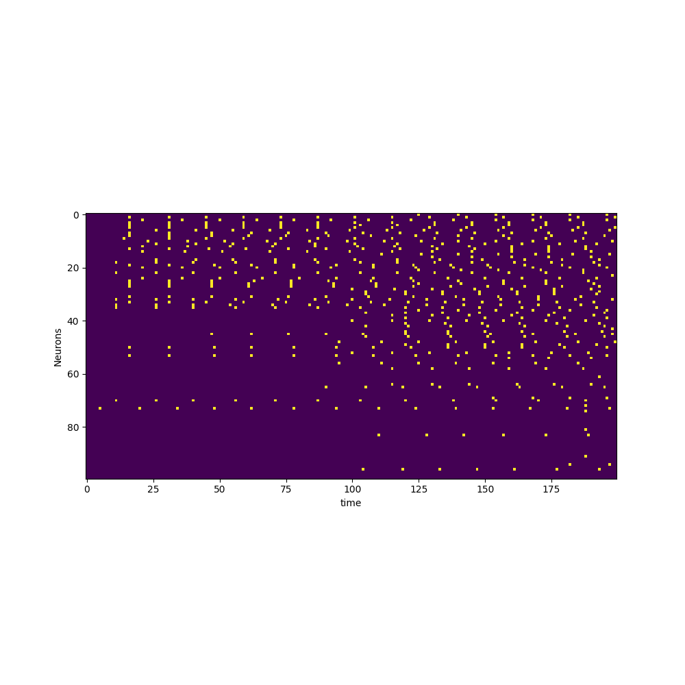

Neuroscience Course Projeect: Reprodcing the paper: "Neutral Theory and Scale-Free Neural Dynamics" by Matteo Martinello et al.
[Data Drive Link](https://drive.google.com/drive/folders/1d6GzRdVOSJVxfvDrmtRBFFYy9v-H4kqH?usp=sharing)

